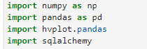
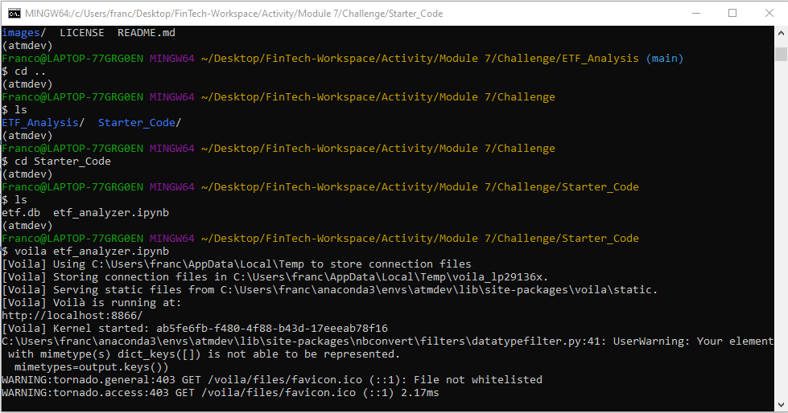
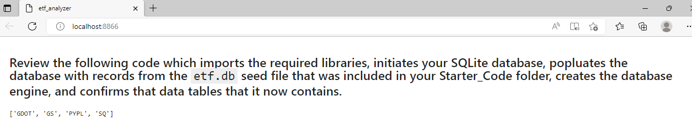
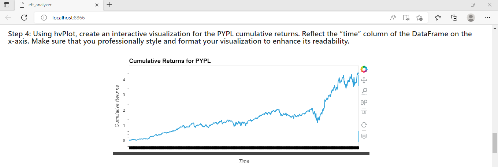
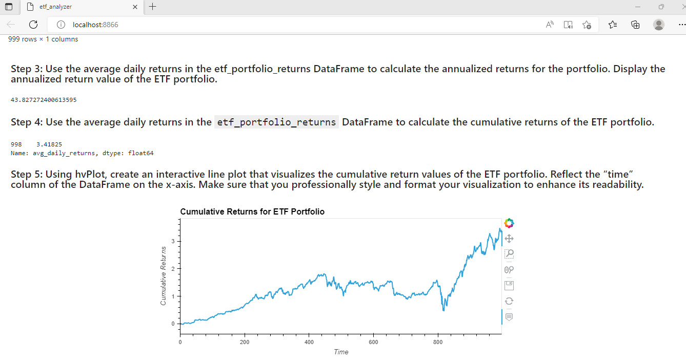

# ETF_Analysis

___
This week, I will look into passive investing by analyzing exchange-traded funds (ETF).

I will do so by building a financial database and web application by using SQL, Python, and the Voilà library to analyze the performance of a hypothetical fintech ETF.

---

## Technologies

This project leverages python 3.7 with various Libraries and IDE:

* [Jupyterlab](http://justinbois.github.io/bootcamp/2020_fsri/lessons/l01_welcome.html#Jupyter) - An interactive development environment

* [SQL](https://www.w3schools.com/sql/) - SQL is a language that was designed to help manage and analyze data that’s in databases.

* [Voila](https://voila.readthedocs.io/en/stable/) - A Python library that allows one to convert a Jupyter Notebook into an interactive dashboard that allows you to share your work with others.

* [PyViz](https://pyviz.org/overviews/index.html) - a is a Python visualization package that provides a single platform for accessing multiple visualization libraries, including hvPlot and GeoViews.

* [hvPlot](https://hvplot.holoviz.org/user_guide/Plotting.html) -  a high-level plotting API built on HoloViews that provides a general and consistent API for plotting data in various formats.

---

## Installation Guide

In order to run the application, one should first install SQLAlchemy and Voila.

* Install SQLAlchemy

* Install Voila

* Install PyViz

---

## Usage
To use the analysis, clone the repository and run the etf_analyzer.ipynb notebook within the Jupyter Notebook.

---

## Deploying the Notebook as a Web Application
Deploy the notebook using the Voila Library:

* Deploy via Voila Library

Following are some screenshots of the notebook using voila:

* Tables in etf.db

* Pypl Cummulative Returns

* ETF Portfolio Cummulative Returns

---

## Contributors

Brought to you by Franco Thomas via the Columbia Engineering FinTech Bootcamp.

Significant contributions made by subcontractors Professor Marghub Mirza, TA Ashfaque, and TA Boomin Kwon.

---

## License

MIT